# Lethus

**Dynamic Context Pruning for Long-Form Dialogue Memory**

Lethus implements DYCP (Dynamic Context Pruning) from the research paper ["Dynamic Context Pruning for Long-Form Dialogue"](https://arxiv.org/abs/2601.07994), achieving state-of-the-art performance in conversational memory retrieval with 83.27% answer quality and sub-second latency.

### 1. Problem: The "Context-Cost" Dilemma in Long-Form Dialogue

**The Core Conflict:**
Developers building conversational AI agents (Code Assistants, RPG NPCs, Therapy Bots) are currently forced to choose between two broken architectures: **(Standard RAG)** or **"(Full Context)**

**Who experiences it?**

* **AI Engineers:** Struggling to manage token budgets while maintaining conversation coherence.
* **End Users:** Frustrated when an AI forgets a variable name defined 20 minutes ago or loses the "thread" of a complex debugging session.

**Why is it painful today? (The Gap Analysis)**

* **The "Goldfish" Memory of Standard RAG:**
Standard Retrieval-Augmented Generation (RAG) fetches isolated "chunks" of text. In a conversation, context is temporal, not just semantic. If you search for *"Why did it fail?"*, standard RAG retrieves the error message but **misses the 10 previous turns** of setup that explain *why*. The result is an AI that hallucinates or gives generic advice.
* **The Latency & Cost of Full Context:**
Sending a full 50-turn conversation history (approx. 15k tokens) to GPT-4 costs ~$0.45 *per message* and introduces 3-5 seconds of latency. This makes real-time, continuous learning applications economically impossible to scale.
* **The Pronoun Problem:**
Vector search is blind to references. If a user says *"Change **it** to port 3000,"* standard embedding models fail to resolve what "**it**" refers to, leading to 0% recall on critical instruction updates.


### 2. Constraints & Assumptions

**What makes this problem hard? (Technical Constraints)**

* **The Latency Budget (< 200ms overhead):**
Because Lethus acts as a proxy *between* the user and the LLM, any processing time is additive. To maintain a "real-time" feel, the entire pipeline (Vector Search → Ghost Graph Resolution → DYCP Algorithm → Context Injection) must execute in milliseconds. A retrieval system that is accurate but slow (e.g., >1s) fails the user experience test compared to raw caching.
* **The "Needle in a Haystack" Phenomenon:**
LLM performance degrades non-linearly as context length increases. Research shows that even 1M-token models suffer from the "Lost in the Middle" effect, where facts buried in the center of a prompt are ignored.
* **The "Pronoun Ambiguity" Constraint:**
Standard embedding models (like OpenAI's `text-embedding-3`) are semantically blind to pronouns. The vector for *"delete it"* is mathematically distant from *"delete the production database"*, even if they refer to the same object in context. A purely vector-based solution will always fail on these critical dependency resolutions.
* **API Compatibility Lock-in:**
To ensure adoption, we assume we cannot force developers to rewrite their application logic. The solution must adhere strictly to the LLMs' API spec, meaning we cannot ask for extra metadata or side-channel signals from the client. We must infer everything from the raw `messages` array.

**Real-World Assumptions**

* **Locality of Reference:**
We assume human dialogue follows "bursty" patterns, users tend to discuss a specific topic for several turns before switching. This validates the use of Kadane's Algorithm to find contiguous spans rather than scattered sentences.
* **The "Semantic Decay" Hypothesis:**
We assume that in the absence of explicit recall triggers, recent information is exponentially more relevant than older information. A variable defined 5 minutes ago is more likely to be used now than one defined 5 days ago.
* **Economic Rationality:**
We assume that developers prioritize **predictable cost** over **infinite memory**. They prefer a system that guarantees a fixed input size (e.g., 4k tokens) regardless of conversation length, rather than a system where costs scale linearly with time.


### 3. Proposed Solution: Signal-Based Contextual Pruning

**The Core Idea: Conversation as a Signal**
We reject the industry-standard "Search Engine" approach to memory (RAG). Instead of treating a conversation as a "bag of scattered facts," Lethus treats it as a **continuous temporal signal**.

Our solution, **Dynamic Context Pruning (DYCP)**, applies signal processing techniques, specifically a modified **Kadane’s Algorithm** to the conversation history. We calculate a "relevance waveform" for the entire dialogue and surgically extract the high-signal *episodes*, preserving the causal structure (Context → Problem → Solution) that standard retrieval destroys.

**The 3-Pillar Architecture:**

1. **Dynamic Context Pruning (The "Signal Filter"):**
By normalizing semantic scores (Z-scores) and applying a strict gain threshold (), we filter out the "noise" of chit-chat. Kadane's Algorithm then identifies **contiguous spans** of high relevance.
* *Benefit:* The LLM receives complete narrative arcs, not fragmented sentences. It understands *why* a decision was made 20 turns ago, not just *that* it was made.


2. **The Ghost Graph (The "Entity Anchor"):**
We overlay a lightweight Knowledge Graph on top of the vector search. This graph tracks the lifecycle of entities (variables, configs, URLs). When a user says *"fix **that** error,"* the graph resolves "**that**" to the specific error log from Turn #45 and artificially boosts its signal.
* *Benefit:* Solves the "Pronoun Blindness" of vector search, achieving nearly 100% recall on implicit references.


3. **Semantic Decay (The "Temporal Gravity"):**
We recognize that conversational context has a "half-life." We apply a configurable exponential decay factor (lamda) to all history embeddings. This forces older memories to "fight harder" to be recalled a message from 100 turns ago must be **semantically precise** to survive, while recent messages are prioritized by default.
* *Benefit:* Eliminates the "Old Context" problem where outdated instructions (e.g., an old code snippet you've since rewritten) clutter the context window and confuse the model.


**Why is this the right approach?**

* **Coherence over Keywords:** Standard RAG might retrieve a variable definition but miss the warning message immediately preceding it. DYCP retrieves the entire "warning-definition" block because they are temporally adjacent and semantically linked.
* **Drop-In Simplicity:** By architecting this as an **LLM compatible proxy**, we solve the problem at the infrastructure layer. Developers don't need to rewrite their prompt chains; they just change their `base_url`.

**Strategic Tradeoffs**

* **Latency vs. Quality:** We accept a computational overhead of **~100-200ms** per turn to run the Graph and DYCP algorithms. We believe this tradeoff is critical: a fast answer that is hallucinated (due to bad context) is worse than a slightly slower answer that is correct.
* **Precision vs. Recall:** We tune our thresholds () to be conservative. We effectively choose to "forget" weakly relevant information to ensure we never pollute the context window with distracting noise, prioritizing **high-precision context** over broad recall.


### 4. System Architecture

Lethus is architected as a **high-concurrency middleware proxy** that intercepts standard OpenAI API calls. It decouples the retrieval latency from the response stream, using an async "write-back" pattern to maintain sub-second overhead.

#### High-Level Data Flow

```mermaid
sequenceDiagram
    participant Client
    participant Proxy as Lethus (FastAPI)
    participant Core as Engine (Milvus/SpaCy)
    participant LLM as OpenAI

    Client->>Proxy: POST /chat/completions
    
    rect rgb(20, 20, 20)
        Note right of Proxy: CRITICAL PATH (<200ms)
        Proxy->>Core: 1. Extract Entities (SpaCy)
        Proxy->>Core: 2. Hybrid Search (Milvus)
        Core->>Proxy: 3. DYCP Signal Processing
    end
    
    Proxy->>LLM: Forward with Context
    LLM-->>Client: Stream Response
    
    Note right of Proxy: ASYNC WRITE-BACK
    Proxy->>Core: Index new turn & Update Graph

```



#### Core Components & Rationale

* **The Proxy (Python + FastAPI):** Chosen for native `async/await` support. It handles high-concurrency chat streams without blocking, validating payloads via Pydantic before hitting the core logic.
* **NLP Engine (SpaCy):** We explicitly rejected LLM-based extraction for the Ghost Graph. SpaCy runs locally on CPU with **~15ms overhead**, whereas an LLM call would add 500ms+ latency.
* **Vector Store (Milvus):** Selected for **Hybrid Search** capabilities. We pre-filter using scalar metadata (timestamps) before computing vector similarity, drastically reducing the search space for the DYCP algorithm.
* **State Management (PostgreSQL):** Acts as the immutable log. While Milvus handles fuzzy retrieval, Postgres ensures zero data loss and relational integrity for user configs and graph edges.
* **Frontend (Next.js):** Server-side rendering to easily showcase the implementation.

#### Failure Modes & Edge Cases

**Milvus Unavailability**
- Graceful degradation to pass-through mode (forwards requests directly to OpenAI)
- Auto-reconnect with exponential backoff (5s → 30s → 2m)
- Chat continues functioning without memory features

**Cold Start (N < 2 messages)**
- DYCP skipped, returns full message array
- Kadane's algorithm requires N≥2 for span detection
- <10ms overhead (entity extraction only)

**Semantic Similarity Collapse**
- All query-history similarity scores ≈ 0
- Returns last 3 turns as minimum context
- Logs: "No relevant spans found, using recency fallback"

**Token Budget Overflow**
- Greedy truncation: keep highest-scoring spans first
- Single span > max_tokens splits at message boundary
- Response header: `X-Lethus-Truncated: true`

**Concurrent Write Conflicts**
- PostgreSQL SERIALIZABLE isolation prevents dirty writes
- Second request waits ~20ms for lock release
- Logs warning if wait time >100ms

**OpenAI API Failure**
- Returns upstream error to client (429, 503)
- No automatic retry (maintains API compatibility)
- Turn NOT saved on LLM failure (consistency guarantee)

**Embeddings API Timeout**
- Async write-back timeout doesn't block response stream
- Returns HTTP 503 on critical path failure
- Background retry 3x with exponential backoff

**Database Connection Pool Exhaustion**
- SQLAlchemy pool blocks when >100 concurrent requests
- HTTP 504 after 30s timeout
- Alert if pool utilization >80% for >5min

### 5. Ideal End State & Production Readiness

If deployed as a global SaaS, Lethus leverages its decoupled proxy architecture to scale without rewriting core logic.

**How It Scales (Read/Write Separation)**
The architecture is natively split:

* **Inference (Read):** The FastAPI proxy is stateless and CPU-light. It scales horizontally via container orchestration (Docker/K8s) to handle unlimited concurrent chat streams.
* **Ingestion (Write):** The "Async Write-Back" design protects latency. Heavy operations (embedding generation, graph updates) happen *after* the response is sent. In production, these move to a durable message queue, ensuring a spike in traffic never degrades the sub-second retrieval speed.

**What Breaks First? (Bottlenecks)**

* **Graph Traversal CPU Cost:** As conversation histories grow (10k+ turns), the in-memory graph traversal (Python/NetworkX logic) becomes CPU-bound. 
**Fix:** Cache hot graph paths in Redis.

* **Vector Search Latency:** Milvus performance degrades with index size. 
**Fix:** Implement aggressive time-based partitioning in Postgres/Milvus, ensuring we only query the "active" temporal window rather than the full historical dataset.

**What Needs Hardening?**

* **Data Sovereignty:** As a "Man-in-the-Middle" proxy, we store sensitive context. Production requires a **PII Redaction Layer** (using SpaCy's entity recognition) to sanitize names/keys *before* they hit the database, ensuring strict privacy compliance.


### 6. Hackathon Scope & Execution

**What We Engineered in 24 Hours**
We focused strictly on the "high-risk" backend logic proving that the mathematical theory (DYCP) translates to functioning code.

* **The "Invisible" Proxy:** We built a fully compliant `POST /v1/chat/completions` endpoint in **FastAPI**. It successfully intercepts standard OpenAI client requests, injects context, and streams responses without breaking the client's expectation.
* **The Algorithm Core:** We implemented the complete **DYCP Pipeline** (Z-score normalization  Kadane’s span selection) and the **Semantic Decay** formula in Python. This is not a simulation; it effectively prunes context in real-time.
* **The Ghost Graph Engine:** We integrated **SpaCy** for entity extraction and built the in-memory graph traversal logic. It successfully links pronouns ("it") to technical entities ("API_KEY") across turns.
* **Infrastructure:** We dockerized the entire stack (**Milvus, Postgres, FastAPI, Next.js**) into a single `docker-compose` tailored for instant local deployment.

**What Is Stubbed / Simplified**
To fit the 24-hour constraints, we made strategic engineering trade-offs:

* **Prefetching Logic:** The "Predictive Prefetcher" currently uses rule-based templates (e.g., if query contains "how", prefetch "why") rather than a trained predictive model.
* **Auth & Security:** The system runs in "Single-Tenant Mode." User authentication is bypassed for the demo to focus purely on the retrieval mechanics.

**Why This Slice Demonstrates the Core Idea**
This implementation isolates the **hardest technical problem**: Can we mathematically filter conversation noise *without* breaking the narrative flow?
By shipping the **Proxy + DYCP Algorithm + Ghost Graph**, we proved that "Signal-Based Retrieval" is not just academic theory, it is a viable, high-performance architecture that can run on a standard laptop today. We demonstrated that you don't need massive context windows to have perfect memory; you just need better signal processing.

### 7. How to Run / Demo

#### Prerequisites
- Docker and Docker Compose installed
- Python 3.10+ (for backend)
- Node.js 18+ (for frontend)

#### Quick Start

1. **Clone and navigate to the repository**
```bash
git clone <repository-url>
cd Lethus
```

2. **Set up environment variables**
```bash
cp .env.example .env
# Edit .env and add your OpenAI/GitHub Models API key
```

3. **Start infrastructure services**
```bash
cd docker
docker-compose up -d
```

This starts:
- PostgreSQL (port 5432)
- Milvus vector database (port 19530)
- etcd (Milvus dependency)
- MinIO (Milvus storage)

4. **Install Python dependencies**
```bash
cd ..
python -m venv .venv
source .venv/bin/activate  # On Windows: .venv/Scripts/activate
pip install -e .
```

5. **Download SpaCy model** (required for Ghost Graph entity extraction)
```bash
python -m spacy download en_core_web_sm
```

6. **Start the backend**
```bash
lethus
```

The API will be available at `http://localhost:8000`

7. **Start the frontend** (in a separate terminal)
```bash
cd frontend
npm install
npm run dev
```

Access the UI at `http://localhost:3000`

#### Demo Scenarios

**Scenario 1: Basic Context Pruning**
Run the example script to see DYCP in action:
```bash
python examples/07_comparison_demo.py
```

This demonstrates:
- A 50-turn conversation being reduced to relevant spans
- Token savings (typically 60-80% reduction)

**Scenario 2: Proxy Usage (OpenAI-Compatible)**
```bash
python examples/06_proxy_usage.py
```

Shows how to use Lethus as a drop-in replacement for OpenAI's API endpoint.

**Scenario 3: Interactive Chat with UI**
1. Open `http://localhost:3000`
2. Configure your OpenAI API key in Settings
3. Start a conversation
4. Notice the DYCP statistics showing token reduction after each response

#### Verifying the System

Check that all services are running:
```bash
docker ps  # Should show lethus-postgres, milvus-standalone, milvus-etcd, milvus-minio
curl http://localhost:8000/health  # Backend health check
```

View DYCP stats in action:
- Chat logs show original vs reduced message counts
- Frontend displays reduction percentages after each message


### 8. Notes on AI Usage

We utilized AI tools ( Claude 4.5 Sonnet) strictly as accelerators for implementation, while the architectural decisions, system constraints, and "Signal-Based" core thesis were human-driven.

* **Human-Led Engineering:**

* **System Design:** The decision to architect Lethus as a "Man-in-the-Middle" proxy rather than a client-side library.
* **Constraint Selection:** The choice to strictly enforce a <200ms latency budget, necessitating the use of SpaCy (CPU) over LLMs for entity extraction.
* **Algorithm Adaptation:** The conceptual mapping of **Kadane’s Algorithm** traditionally used for maximum subarray problems, to the domain of conversational relevance scoring.


* **AI-Assisted Implementation:**
* **Mathematical Translation:** We leveraged AI to rapidly translate the formal mathematical notation of the DYCP algorithm (Z-score normalization and decay formulas) into vectorized NumPy operations.
* **Boilerplate & Config:** AI was instrumental in generating the Pydantic schemas for the API endpoints and scaffolding the `docker-compose` orchestration for Milvus/Postgres integration.

**Full Disclosure:**
A detailed log of all AI-generated files, specific prompts used, and the refinement process is available in the **`AI.md`** file in this repository. Our core logic modules reflect our specific understanding of the research paper and deliberate design trade-offs.